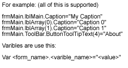



## One of the best language localisation engine

### Description

I wrote this language engine, when i needed multilanguage support for my one application. Lot of multilanguage engines isn't good, bud this is by my opinion one from the best. It supports varibles, index of controls and all keys in controls. Look on the picture for example and test the source. Vote please for me. This is my first posted source on Planet Source Code.

Thanks you. Warnings for all: My mother tongue is czech.
 
### More Info
 

             |
---                |---
**Submitted On**   |2003-02-01 18:50:02
**By**             |[Martin Sloup](https://github.com/Planet-Source-Code/PSCIndex/blob/master/ByAuthor/martin-sloup.md)
**Level**          |Intermediate
**User Rating**    |4.4 (71 globes from 16 users)
**Compatibility**  |VB 6\.0
**Category**       |[VB function enhancement](https://github.com/Planet-Source-Code/PSCIndex/blob/master/ByCategory/vb-function-enhancement__1-25.md)
**World**          |[Visual Basic](https://github.com/Planet-Source-Code/PSCIndex/blob/master/ByWorld/visual-basic.md)
**Archive File**   |[One\_of\_the153800222003\.zip](https://github.com/Planet-Source-Code/martin-sloup-one-of-the-best-language-localisation-engine__1-42868/archive/master.zip)

